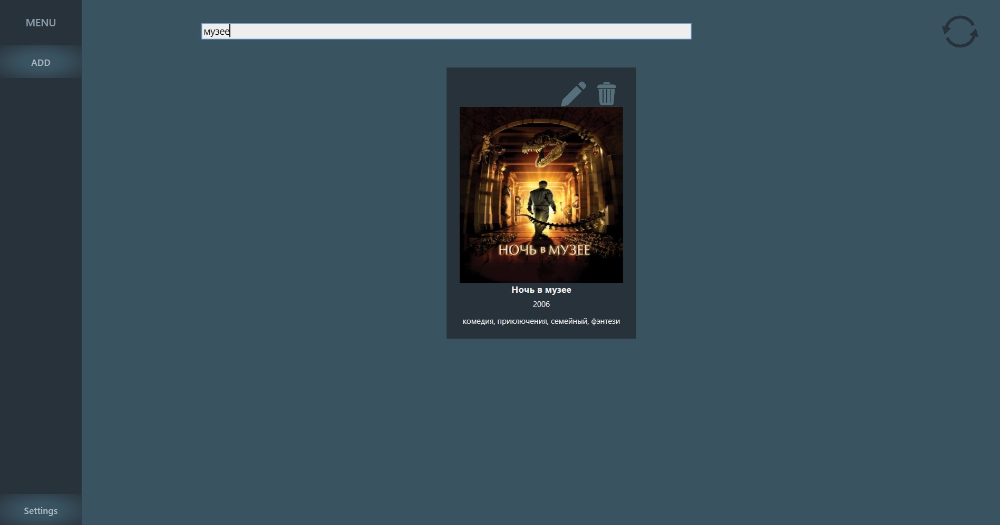
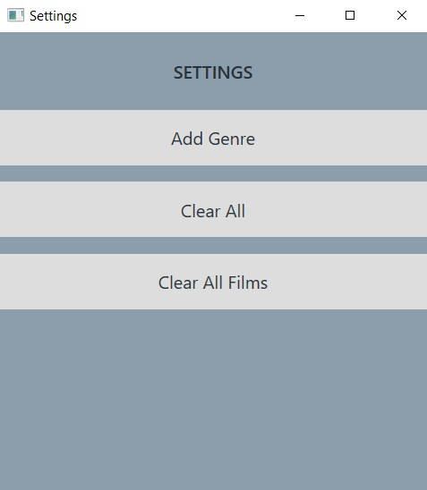

## Film library app for desktop.

### Add
To start click 2 times button `Add`.
You can insert image by browsing it (`Browse` field) from your local machine or by pasting it with `Ctrl+V`.
To select genre click on any genre element. It will be selected.

### Settings
To add a new genre, clear all tables or clear just film table click 2 times button `Settings`. 

### Screenshots

